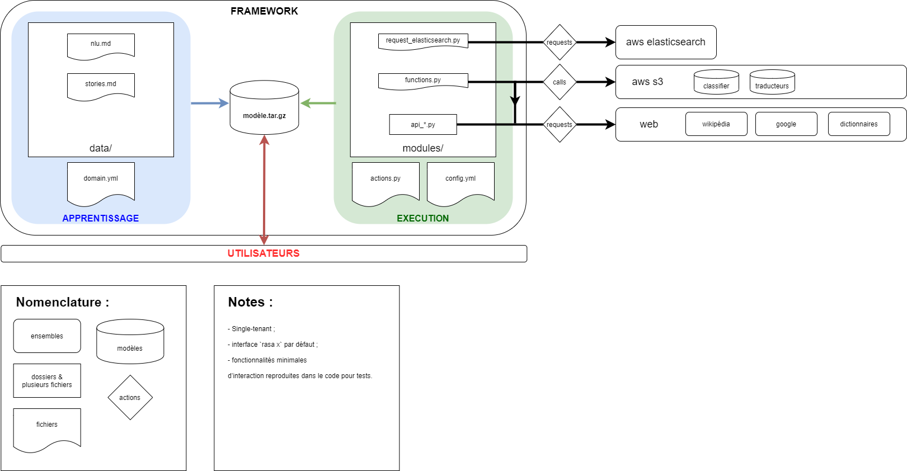

Version 1.x of the RASA framework.

## deploy architecture


## remote setup
* get last `chatbot` repo update, 
* if to be installed on vm or instance: from local `scp` repo to target (usually pointing at `/home/os/chatbot/`),
* from the target folder, install necessary requirements and deploy:
```bash
bash ./deploy.sh
```
It will download and setup a bunch of requirements and train your model which then will be saved in `.../chatbot/models/` folder.

## remote run
* open a first terminal and enter following commands:
```bash
cd /home/ubuntu/chatbot
screen
conda activate rasa
rasa run actions
```
* open a second terminal and enter following commands:
```bash
cd /home/ubuntu/chatbot
screen
conda activate rasa
rasa x
```
* you can close the terminals
* to reconnect to "screened" terminals open terminal and:
  * `screen -ls`: lists terminals id,
  * `screen -r { id }`: returns to the corresponding "screened" terminal

## connect to chatbot
* password embedded in url provided in second terminal `rasa x`  
* go to url: `<target/password>:port`

## docs
[v1.x docs](https://legacy-docs-v1.rasa.com/)